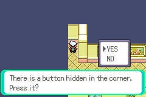
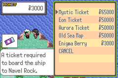

# feature/available-mystery-gifts

This feature introduces a way to activate the locked mystery gift events through normal gameplay. 

By default it is enabled from the very start of the game, but can be configured to only be permitted after the player beats the game.

## Mystery Gifts

The following mystery gift items are available for purchase at the given prices:

| Item               | Price  |
|--------------------|--------|
| ITEM_MYSTIC_TICKET | $65000 |
| ITEM_EON_TICKET    | $50000 |
| ITEM_AURORA_TICKET | $50000 |
| ITEM_OLD_SEA_MAP   | $50000 |
| ITEM_ENIGMA_BERRY  | $3000  |

Additionally, the corresponding flags to allow accessing the mystery gifts are all set.

## Location and Mechanics

All mystery gift items are sold to the player from a girl at *Lilycove Lookout* - a new location that
is accessible at the back of Lilycove Museum 1F. 

Interacting with the wall at the back corner of the floor reveals a button that can be pressed.
If `FLAG_LILYCOVE_MYSTERYGIFT_OUTLOOK_ACCESSIBLE` is set, pressing the button opens a hidden door that leads to Lilycove Lookout. 
If this flag is not set, then the button will simply state that 'Nothing happened!'. 

If the `OW_LILYCOVE_MYSTERYGIFT_ACCESSIBLE_FROM_START` define in `include/config/overworldh` is set to `TRUE`, 
then the flag will start the game as TRUE and will allow players to travel to these locations by the time they reach Lilycove City. 
If the define is changed to `FALSE`, then the flag will only be set when the
player beats the game.