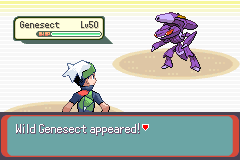

# feature/extended-mystery-gifts

This feature introduces locations and encounters to mimic the corresponding events from later games, common myths and brand new theoretical encounter events.

It is based on the feature/available-mystery-gifts

This feature uses:
- merge/dynmulti: improve the Lilycove Harbour ticket selection.
- merge/overworld-expansion: Use 16 bit sprite gfx ids
- merge/overworld-pokemon: Sprite gfx for the extra overworld pokemon.
- merge/dynamic-ow-pals: Better loading of palettes for sprites.
- merge/sideways-stairs: Stairs used in some maps.
- feature/custom-transitions-battlemusic: Customise transitions from scripting.
- feature/location-battle-music: Customise battle music for other regions.
- feature/multi-region: Support for other regions.
- feature/enhanced-movement: Movement features for Meloetta's dance.
- feature/general-improvements: getweather+finditem script cmd, extend trainer slide in message, etc.

# List of Locations

## Southern Island

Features Latias or Latios, whichever the player did not choose after beating the Elite Four, OR Latios if the player has not beaten the Elite Four.

## Navel Rock

Features both Ho-oh and Lugia.

## Birth Island

Features Deoxys.
## Faraway Island

Features Mew.

## Liberty Garden

A new area from the Unova region. Features Victini at the basement of the lighthouse.

The player can travel here if they have the Liberty Ticket and pay a voyage fee of $10000.

In addition, the player can also encounter the following Pokemon in the tall grass around the island:

| Pokemon   |Chance |
|:---------:|:-----:|
| Patrat    | 24%   |
| Pidove    | 20%   |
| Timburr   | 10%   |
| Petilil   | 10%   |
| Gothita   | 10%   |
| Blitzle   | 10%   |
| Pansage   | 5%    |
| Pansear   | 5%    |
| Panpour   | 5%    |
| Axew      | 1%    |

## Liberty Pier (Castelia City)

The player can travel here if they have the Liberty Ticket and pay a voyage fee of $10000. The player has the option of travelling to Liberty Pier in Castelia City whenever they travel to Liberty Garden and vise versa.

Unlike in Pokemon Black/White or Black 2/White 2, the Liberty Pier is set up as a flea market. The player can obtain the following items:

- Castelia Cone
- Rage Candy Bar
- Sweet Heart
- Rocky Helmet
- Protective Pads
- Assault Vest
- Blunder Policy
- Eject Button
- Eject Pack
- Red Card

Additionally the player can obtain the following Mega-Evolution items:

- **Mega Ring**
- Sceptilite
- Swampertite
- Blazikenite
- Gardevoirite
- Galladite
- Aggronite
- Medichamite
- Mawilite
- Glalitite
- Manectite
- Banettite
- Absolite
- Latiasite
- Latiosite
- Sharpedonite
- Cameruptite
- Altarianite
- Metagrossite
- Salamencite*

*The Salamencite can only be obtained by sharing a Rage Candy Bar with a hungry person.

## Cafe Sonata and Narrow Street (Castelia City)

Narrow Street can be accessed in Castelia City to the east of Liberty Pier. This street provides access to Cafe Sonata where Meloetta can be found after talking to the bard.

Additionally, the bartender sells:
- Berry Juice
- Big Malasada
- Exp Candies XS to XL
- Micle Berry
- Custap Berry
- Jaboca Berry
- Rowap Berry
- Kee Berry
- Maranga Berry

## Unova Route 17 and P2 Laboratory

There is an encounter with a scientist and reporter/cameraman at Liberty Pier in Castelia City that will unlock travel to Unova Route 17.

At the end of the route lies the P2 Laboratory where Genesect can be encountered.

After capturing Genesect, the player can receive their choice of the Genesect Drives to change the type of Techo Blast. Only one may be given at a time. (This is intentional primarily to save precious bag space)

## In Progress
- Space
    - Jirachi

# Planned Locations

## Space

Travel to space to encounter Jirachi.

## Ilex Forest

The Ilex Forest shrine will enable a Celebi encounter.

## Diancie

An encounter and location for Diancie.

## Location and Mechanics
